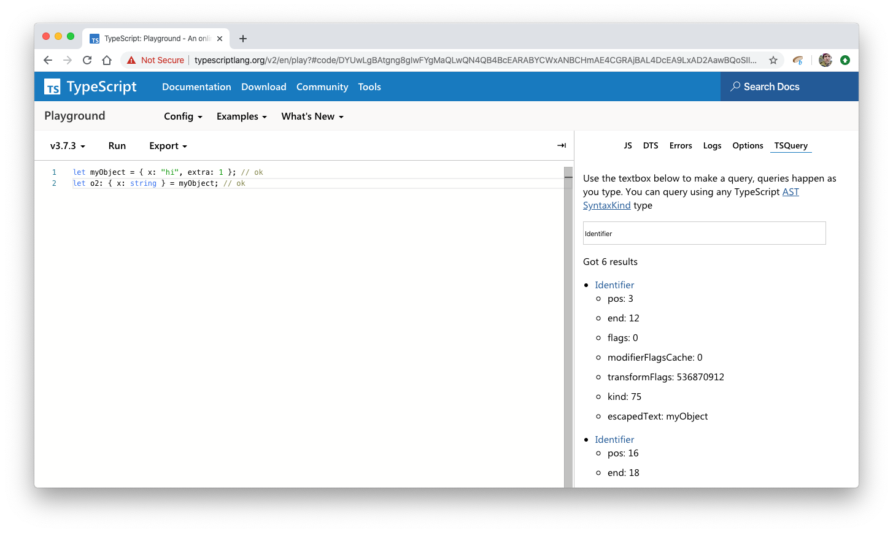

## TypeScript Playground Plugin

Lets you run TSQuery in realtime



## Running this plugin

- Open up the TypeScript Playground
- Go the "Options" in the sidebar
- Look for "External Plugins"
- Add "playground-plugin-tsquery"
- Reload the browser

Then it will show up as a tab in the sidebar.

## Contributing

See [CONTRIBUTING.md](./CONTRIBUTING.md) for the full details, however, TLDR:

```sh
git clone ...
yarn install
yarn start
```

Then tick the box for starting plugin development inside the TypeScript Playground.
